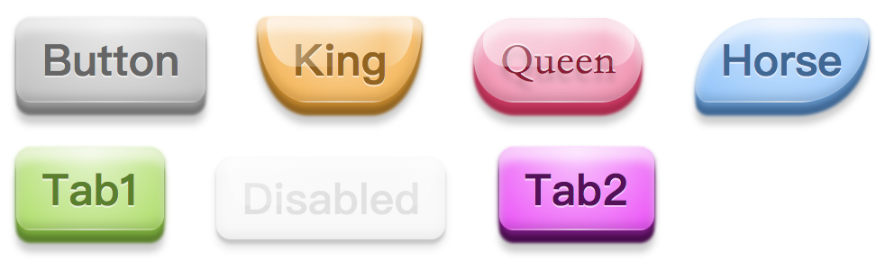
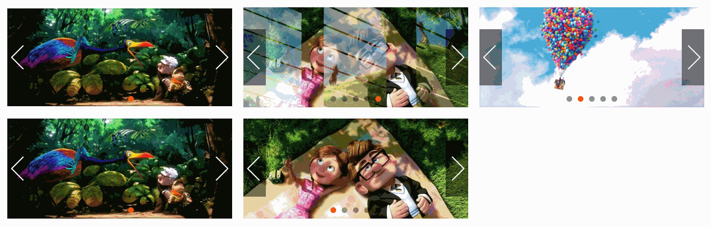
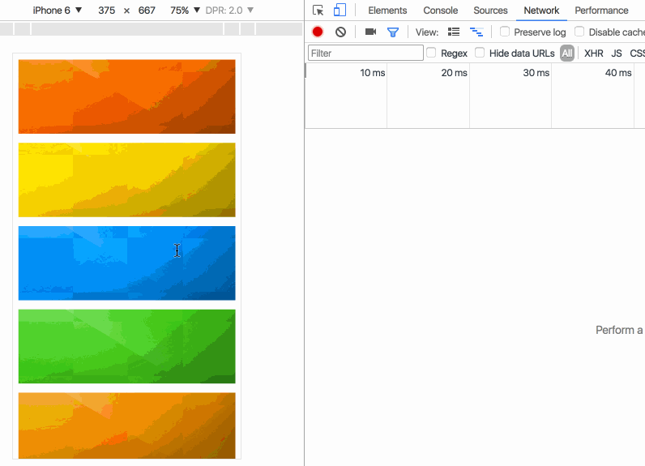
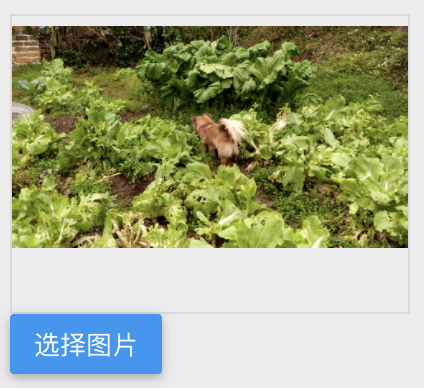
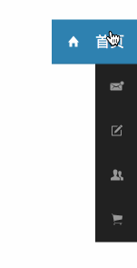
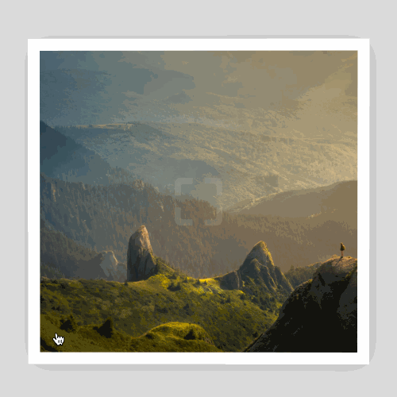

# web-demo
对《Web开发实战》这本书的示例进行了完善和补充，欢迎大家购买这本书，支持作者！

## 《Web》开发实战
这是一本目前为止我看过的最棒的前端实战书籍，其中包含了很多非常实用的例子，同时作者对每一个示例都进行了详尽的解释

* [在线试看地址](https://www.kancloud.cn/dennis/javascriptmethod/261471)
* [购买地址](https://www.kancloud.cn/dennis/javascriptmethod)
* [作者个人博客](http://ghmagical.com/)

## 目录
> 我在这里只会给出代码，并不会给出解释，如果想要了解其中的原理，欢迎购买原书电子版（才￥5，强烈推荐购买！而且如果不购买原书的话，下面的有些原文地址打开是看不到作者的讲解的）

### CSS实战篇

#### 白光划过效果

[原文地址](https://www.kancloud.cn/dennis/javascriptmethod/261473)
[在线演示](http://merrier.github.io/web-demo/CSS/highlight/highlight.html)

#### 3D立方体

[原文地址](https://www.kancloud.cn/dennis/javascriptmethod/261474)
[在线演示](http://merrier.github.io/web-demo/CSS/cude/cude.html)

#### 水中倒影

[原文地址](https://www.kancloud.cn/dennis/javascriptmethod/261475)
[在线演示](http://merrier.github.io/web-demo/CSS/boxReflect/boxReflect.html)

#### 工具提示

[原文地址](https://www.kancloud.cn/dennis/javascriptmethod/261476)
[在线演示](http://merrier.github.io/web-demo/CSS/tooltip/tooltip.html)

#### 单选复选

[原文地址](https://www.kancloud.cn/dennis/javascriptmethod/261477)
[在线演示](http://merrier.github.io/web-demo/CSS/input/input.html)

#### Loading加载

[原文地址](https://www.kancloud.cn/dennis/javascriptmethod/261478)
[在线演示](http://merrier.github.io/web-demo/CSS/loading/loading.html)

#### 图片滤镜

[原文地址](https://www.kancloud.cn/dennis/javascriptmethod/261479)
[在线演示](http://merrier.github.io/web-demo/CSS/filter/filter.html)

#### 阴影

[原文地址](https://www.kancloud.cn/dennis/javascriptmethod/261480)
[在线演示](http://merrier.github.io/web-demo/CSS/boxShadow/boxShadow.html)

#### 3D按钮

[在线演示(普通按钮)](http://merrier.github.io/web-demo/CSS/button/button.html)

[在线演示(3D按钮)](http://merrier.github.io/web-demo/CSS/button/3dButton.html)

[原文地址](https://www.kancloud.cn/dennis/javascriptmethod/261481)

#### 自定义滚动条

[原文地址](https://www.kancloud.cn/dennis/javascriptmethod/261482)
[在线演示](http://merrier.github.io/web-demo/CSS/scrollbar/scrollbar.html)

#### 文字效果

[原文地址](https://www.kancloud.cn/dennis/javascriptmethod/261483)
[在线演示](http://merrier.github.io/web-demo/CSS/textShadow/text.html)

#### 多彩的渐变

[原文地址](https://www.kancloud.cn/dennis/javascriptmethod/261484)
[在线演示](http://merrier.github.io/web-demo/CSS/linearGradient/linearGradient.html)

#### 进度条

[原文地址](https://www.kancloud.cn/dennis/javascriptmethod/261485)
[在线演示](http://merrier.github.io/web-demo/CSS/progress/progress.html)

#### 遮罩条

[原文地址](https://www.kancloud.cn/dennis/javascriptmethod/261486)
[在线演示](http://merrier.github.io/web-demo/CSS/overlay/overlay.html)

#### 切角

[原文地址](https://www.kancloud.cn/dennis/javascriptmethod/261487)
[在线演示](http://merrier.github.io/web-demo/CSS/corner/corner.html)

#### 表单

[原文地址](https://www.kancloud.cn/dennis/javascriptmethod/261488)
[在线演示](http://merrier.github.io/web-demo/CSS/form/form.html)

#### 溢出省略号

[原文地址](https://www.kancloud.cn/dennis/javascriptmethod/261489)
[在线演示](http://merrier.github.io/web-demo/CSS/ellipsis/ellipsis.html)

#### 自定义选择文本样式

[原文地址](https://www.kancloud.cn/dennis/javascriptmethod/261490)
[在线演示](http://merrier.github.io/web-demo/CSS/selection/selection.html)

#### 表格

[原文地址](https://www.kancloud.cn/dennis/javascriptmethod/261491)
[在线演示](http://merrier.github.io/web-demo/CSS/table/table.html)

#### 导航菜单

[原文地址](https://www.kancloud.cn/dennis/javascriptmethod/261492)
[在线演示](http://merrier.github.io/web-demo/CSS/nav/nav.html)

#### 动态的边框

[原文地址](https://www.kancloud.cn/dennis/javascriptmethod/261493)
[在线演示](http://merrier.github.io/web-demo/CSS/border/border.html)

#### 文件上传组件美化

[原文地址](https://www.kancloud.cn/dennis/javascriptmethod/261494)
[在线演示](http://merrier.github.io/web-demo/CSS/fileupload/upload.html)

#### 打字机效果

[原文地址](https://www.kancloud.cn/dennis/javascriptmethod/261495)
[在线演示](http://merrier.github.io/web-demo/CSS/print/typewriter.html)

#### 多形状图像

[原文地址](https://www.kancloud.cn/dennis/javascriptmethod/261496)
[在线演示](http://merrier.github.io/web-demo/CSS/shape/shape.html)

#### 心跳灯和呼吸灯

[在线演示(心跳灯)](http://merrier.github.io/web-demo/CSS/breath/heartbeat.html)

[在线演示(呼吸灯)](http://merrier.github.io/web-demo/CSS/breath/breath.html)

[原文地址](https://www.kancloud.cn/dennis/javascriptmethod/261497)

#### 竖着排的文字

[原文地址](https://www.kancloud.cn/dennis/javascriptmethod/261498)
[在线演示](http://merrier.github.io/web-demo/CSS/vertical/writting.html)

#### 面包屑导航

[原文地址](https://www.kancloud.cn/dennis/javascriptmethod/261499)
[在线演示](http://merrier.github.io/web-demo/CSS/breadcrumb/breadcrumb.html)

#### 首字母下沉

[原文地址](https://www.kancloud.cn/dennis/javascriptmethod/262477)
[在线演示](http://merrier.github.io/web-demo/CSS/letter/letter.html)

#### 美化有序列表

[原文地址](https://www.kancloud.cn/dennis/javascriptmethod/262478)
[在线演示](http://merrier.github.io/web-demo/CSS/orderedList/orderedList.html)

#### 缎带效果

[原文地址](https://www.kancloud.cn/dennis/javascriptmethod/262479)
[在线演示](http://merrier.github.io/web-demo/CSS/ribbon/ribbon.html)

#### webpack盒子动画

[在线演示](http://merrier.github.io/web-demo/CSS/webpack-box/webpack-box.html)

#### 花瓣动画

[在线演示](http://merrier.github.io/web-demo/CSS/flower/flower.html)

### JavaScript实战篇

#### 点击水波纹

[原文地址](https://www.kancloud.cn/dennis/javascriptmethod/261501)
[在线演示](http://merrier.github.io/web-demo/JavaScript/ripple/ripple.html)

#### 手风琴布局

[原文地址](https://www.kancloud.cn/dennis/javascriptmethod/261502)
[在线演示](http://merrier.github.io/web-demo/JavaScript/collpase/collpase.html)

#### 收缩菜单

[原文地址](https://www.kancloud.cn/dennis/javascriptmethod/261503)
[在线演示](http://merrier.github.io/web-demo/JavaScript/shrink/shrink.html)

#### 滑块

[原文地址](https://www.kancloud.cn/dennis/javascriptmethod/261504)
[在线演示](http://merrier.github.io/web-demo/JavaScript/range/range.html)

#### 瀑布流

[原文地址](https://www.kancloud.cn/dennis/javascriptmethod/261505)
[在线演示](http://merrier.github.io/web-demo/JavaScript/fallwall/fallwall.html)

#### 下拉菜单

[原文地址](https://www.kancloud.cn/dennis/javascriptmethod/261506)
[在线演示](http://merrier.github.io/web-demo/JavaScript/dropdown/dropdown.html)

#### 幻灯片

[原文地址](https://www.kancloud.cn/dennis/javascriptmethod/261507)
[在线演示](http://merrier.github.io/web-demo/JavaScript/slide/slide3D.html)

#### 选项卡

[原文地址](https://www.kancloud.cn/dennis/javascriptmethod/261508)
[在线演示](http://merrier.github.io/web-demo/JavaScript/tab/tab.html)

#### 全屏滚动

[原文地址](https://www.kancloud.cn/dennis/javascriptmethod/261509)
[在线演示](http://merrier.github.io/web-demo/JavaScript/fullpage/fullpage.html)

#### 富文本编辑器

[原文地址](https://www.kancloud.cn/dennis/javascriptmethod/261510)
[在线演示](http://merrier.github.io/web-demo/JavaScript/editor/editor.html)

#### 带表情输入的评论框

[原文地址](https://www.kancloud.cn/dennis/javascriptmethod/261511)
[在线演示](http://merrier.github.io/web-demo/JavaScript/comment/comment.html)

#### 图片懒加载

[原文地址](https://www.kancloud.cn/dennis/javascriptmethod/261512)
[在线演示](http://merrier.github.io/web-demo/JavaScript/lazyloader/lazyload.html)

#### 开启全屏

[原文地址](https://www.kancloud.cn/dennis/javascriptmethod/261513)
[在线演示](http://merrier.github.io/web-demo/JavaScript/fullscreen/fullscreen.html)

#### 返回顶部

[原文地址](https://www.kancloud.cn/dennis/javascriptmethod/261514)
[在线演示](http://merrier.github.io/web-demo/JavaScript/toTop/toTop.html)

#### 上传图片预览

[原文地址](https://www.kancloud.cn/dennis/javascriptmethod/261515)
[在线演示](http://merrier.github.io/web-demo/JavaScript/uploadReview/uploadReview.html)

#### 走马灯

[原文地址](https://www.kancloud.cn/dennis/javascriptmethod/261516)
[在线演示](http://merrier.github.io/web-demo/JavaScript/marquee/marquee.html)

#### 万年历

[原文地址](https://www.kancloud.cn/dennis/javascriptmethod/261517)
[在线演示](http://merrier.github.io/web-demo/JavaScript/calendar/calendar.html)

#### 树形菜单

[原文地址](https://www.kancloud.cn/dennis/javascriptmethod/261518)
[在线演示](http://merrier.github.io/web-demo/JavaScript/tree/tree.html)

#### 旋转加载

[原文地址](https://www.kancloud.cn/dennis/javascriptmethod/261519)
[在线演示](http://merrier.github.io/web-demo/JavaScript/circleLoading/circleLoading.html)

#### 固定头的表格

[原文地址](https://www.kancloud.cn/dennis/javascriptmethod/261520)
[在线演示](http://merrier.github.io/web-demo/JavaScript/table/table.html)

#### 圆形水波纹加载进度

[原文地址](https://www.kancloud.cn/dennis/javascriptmethod/261521)
[在线演示](http://merrier.github.io/web-demo/JavaScript/rippleLoading/rippleLoading.html)

#### 检测是否移动端

[原文地址](https://www.kancloud.cn/dennis/javascriptmethod/261522)
[在线演示](http://merrier.github.io/web-demo/JavaScript/isMobile/checks.html)

#### 搜索过滤

[原文地址](https://www.kancloud.cn/dennis/javascriptmethod/261523)
[在线演示](http://merrier.github.io/web-demo/JavaScript/search/filter.html)

#### 弹幕

[原文地址](https://www.kancloud.cn/dennis/javascriptmethod/261524)
[在线演示](http://merrier.github.io/web-demo/JavaScript/barrage/barrage.html)

#### 自定义滚动条

[原文地址](https://www.kancloud.cn/dennis/javascriptmethod/261525)
[在线演示](http://merrier.github.io/web-demo/JavaScript/scroll/scroll.html)

#### 城市联动选择器

[原文地址](https://www.kancloud.cn/dennis/javascriptmethod/261526)
[在线演示](http://merrier.github.io/web-demo/JavaScript/citys/citys.html)

#### 滚动监听

[原文地址](https://www.kancloud.cn/dennis/javascriptmethod/266765)
[在线演示](http://merrier.github.io/web-demo/JavaScript/scrollSpy/scrollSpy.html)

#### 边栏悬浮菜单

[原文地址](https://www.kancloud.cn/dennis/javascriptmethod/266766)
[在线演示](http://merrier.github.io/web-demo/JavaScript/scroll_menu/scrollMenu.html)

#### 容器上的悬浮效果

[原文地址](https://www.w3cplus.com/css/animate-a-container-on-mouse-over-using-perspective-and-transform.html)
[在线演示](http://merrier.github.io/web-demo/JavaScript/suspension/suspension.html)

### canvas实战篇

#### 雪花纷飞

[原文地址](https://www.kancloud.cn/dennis/javascriptmethod/261528)
[在线演示](http://merrier.github.io/web-demo/Canvas/snow/snow.html)

#### 粒子动画

[原文地址](https://www.kancloud.cn/dennis/javascriptmethod/261529)
[在线演示](http://merrier.github.io/web-demo/Canvas/particle/particle.html)

#### 刮刮卡

[原文地址](https://www.kancloud.cn/dennis/javascriptmethod/261530)
[在线演示](http://merrier.github.io/web-demo/Canvas/card/card.html)

#### 手势密码

[原文地址](https://www.kancloud.cn/dennis/javascriptmethod/261531)
[在线演示](http://merrier.github.io/web-demo/Canvas/gestureLock/gestureLock.html)

#### 截图下载

[原文地址](https://www.kancloud.cn/dennis/javascriptmethod/261532)
[在线演示](http://merrier.github.io/web-demo/Canvas/printscreen/printscreen.html)

#### 图片放大镜

[原文地址](https://www.kancloud.cn/dennis/javascriptmethod/261533)
[在线演示](http://merrier.github.io/web-demo/Canvas/glass/glass.html)

#### 粒子聚合

[原文地址](https://www.kancloud.cn/dennis/javascriptmethod/266767)
[在线演示](http://merrier.github.io/web-demo/Canvas/explode/explode.html)

#### 不规则三角形彩条

[原文地址](http://evanyou.me/)
[在线演示](http://merrier.github.io/web-demo/Canvas/colorBar/colorBar.html)

### 移动实战篇

#### 列表侧滑删除

[原文地址](https://www.kancloud.cn/dennis/javascriptmethod/261535)
[在线演示](http://merrier.github.io/web-demo/Mobile/sliceList/sliceList.html)

#### 移动联动选择器

[原文地址](https://www.kancloud.cn/dennis/javascriptmethod/261536)
[在线演示](http://merrier.github.io/web-demo/Mobile/picker/selector.html)